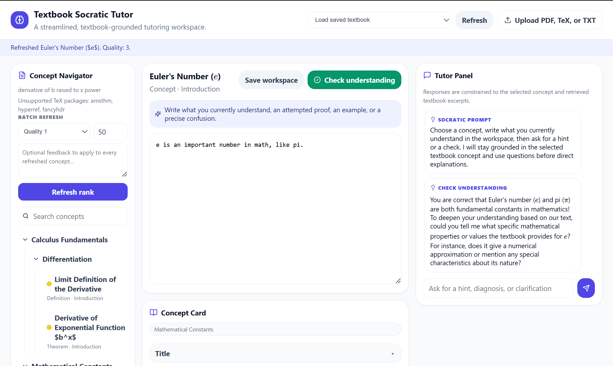

# AI Acknowledgement

The vast majority of the code for this App was generated by Chat-gpt 5.6 under the guidance of myself.

# Textbook Tutor

Textbook Tutor is a tutoring app that turns a `.tex` or `.pdf` instructional text into an LLM-tutor interactive concept-based learning environment where the user writes their understanding in a workspace environment while a local LLM tutor agent guides them in a socratic dialogue style.

Being a mathematician interested in math education, I designed this with math texts in mind, but it appears to be quite effective at tutoring in other disciplines.

There are two main functions in this app: (1) ingesting the text and building concept cards (mostly done by an educator), and (2) the tutoring dynamic with the tutor-LLM (student).

## (1) Ingesting the text and building concept cards

Using an "expert math educator" LLM, the app ingests a textbook, extracts key concepts, and organizes them into a concept map hierarchy.  Then a separate "quality-assurance" LLM evaluates concept-card quality, and lets the user either refine weak concept cards through direct edits, or through single-card or batch regeneration, based on QA-LLM and user feedback.

## (2) Tutoring dynamic

The user selects a concept card from the concept hierarchy.  Each concept card has several information fields.  The following are the currently used fields (though many will probably be removed or consolidated later):

- Title 
- Type 
- Page or source label 
- Textbook definition or excerpt
- Statement 
- Why this matters
- Hierarchy path
- Prerequisites
- Depends on earlier in this section
- Key notation
- Useful examples
- Non-examples or boundary cases
- Common confusions
- Proof ideas
- Related results and nearby concepts
- How the textbook presents it 
- References 
- Concept card quality 
- Refresh feedback 

The user has access to a saveable "Workspace" window in which they write out their understanding of the concept, and a "Tutor panel" in which they directly interact with the tutor-LLM.  The user can click a "Check understanding" button to cause the tutor-LLM to evaluate the content of the Workspace relative to its interpretation of the understanding of the concept intended by the original math text and the concept card.  The tutor-LLM proceeds in a socratic style and encourages the user to develop their understanding in the Workspace.




## Basic Workflow

1. Start your local LLM server.
2. Run the app with `npm run dev`.
3. Upload a textbook .tex file.
4. Wait for ingestion and concept-card QA (this can take a long time depending on your hardware, model choice, and length of .tex file).
5. Select concepts from the navigator.
6. Use the workspace to write notes, attempted explanations, examples, or precise confusions.
7. Ask the tutor for hints, clarification, diagnosis, or understanding checks.

## Concept Quality

Each concept card receives a quality score from the QA-LLM to (1) help the human educator assess concept cards and (2) help the student judge which concept cards to focus their learning around:

- `3`: **well-formed** concept card (indicated by gold circle)
- `2`: possibly not valuable (indicated by silver circle)
- `1`: probably not valuable (no indicator)

The UI uses these ratings to help identify which concept cards may need review or refresh.

**Note:** "well-formed" is the label for highest quality, rather than "valuable" because 

1. It's the responsibility of the human educator to make positive value judgements, and 
2. The QA-LLM exists primarily to flag lack of value and determine concept card cohesiveness with the original text.

## Refresh Workflows

### Single Concept Refresh

A selected concept card can be regenerated using:

- the current concept card,
- the original textbook context,
- the QA LLM feedback,
- and optional user feedback.

This is useful when a card is vague, poorly titled, incorrectly scoped, or missing useful instructional context.

### Batch Refresh

Concepts can also be refreshed in batches by quality rank. For example, you can refresh all concepts with quality `2`, optionally adding feedback that applies to the whole batch.

Use a small batch limit first, because each refreshed concept may require multiple LLM calls.

## Saved Textbooks

Ingested textbooks are saved under:

```text
server/data/textbooks/
```

The app can reload previously ingested textbooks from the saved textbook selector.  This also loads saved Workspaces.

## Important Notes

- Ingested textbook data is stored in `server/data/`.
- Large textbooks may take time to ingest because concept extraction, QA, and refresh operations call the LLM multiple times.
- The app is an active prototype.

## Status

Not well tested.  Works well for my own use so far.  I intend to

- add concept card addition/deletion
- redo GUI aesthetic and default text.  It is currently a rather "eye-rolling AI generated" style.

## Requirements

- Node.js LTS
- npm
- An OpenAI-compatible LLM endpoint

For local use, LM Studio works well. Start the LM Studio server and use its local OpenAI-compatible endpoint.

## Setup

Install dependencies from the project root:

```bash
npm install
```

Create a server environment file:

```bash
cp server/.env.example server/.env
```

Example `.env` for LM Studio:

```env
OPENAI_BASE_URL=http://localhost:1234/v1
OPENAI_API_KEY=lm-studio

PORT=3001
CLIENT_ORIGIN=http://localhost:5173
```

If you want to pin a specific model, add:

```env
OPENAI_MODEL=your-model-id
```

## Run the App

From the project root:

```bash
npm run dev
```

Then open:

```text
http://localhost:5173
```

The backend runs at:

```text
http://localhost:3001
```